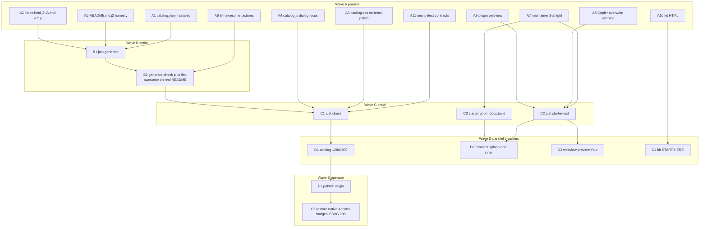

# Plan

Enhance and refine in-scope surfaces so they match [`facts.md`](facts.md) and [`design.md`](../../design.md). This revision answers the plan-gate note: parallel subagent execution with exclusive file ownership and a fine-grained task graph.

**In:** catalog site, generated README, origin publish (operator), maintainer Starlight, Copier Starlight copy, plugin webview, kit HTML. **Out:** React/shadcn/bundler on the catalog; category regroup of the catalog site; awesome.re submission; kit artwork redraw.

Edit sources/templates, then regenerate. Never hand-edit generated catalog sections in `README.md`.

## Critique of the coarse plan

- Ten serial steps hide independent trees (`src/awesome_iina/site`, `catalog/`, `repo/awesome_lint.py`, `starter/`, kit HTML). Those trees do not share files and should land in one wave.
- `just generate` is the only catalog integration lock (README.md + catalog.json + schemas). Site HTML is rendered live by `site_payloads()` — site tests do not wait on generate.
- Featured shrink is data, not chrome. Chrome agents must not touch `catalog.yaml`.
- Origin badges are a two-phase fact: omit now (deterministic, no network in generate); restore native GitHub SVGs only after origin `badge.svg` is `image/svg+xml`. Do not probe GitHub from `just generate`.
- Contrast ≥3:1 is automatable from the known mix formula (`--brand-ink` `#132555` on `--brand-foreground` `#F5FAFF`) without a browser.
- One agent per file. `index.html.j2`, `catalog.css`, `catalog.js`, `catalog.yaml`, and `README.md.j2` are each a mutex.

## Approach

Wave **A** (parallel, eight exclusive owners) lands all source edits. Wave **B** is `just generate`. Wave **C** is `just check` plus starter tests. Wave **D** is live-browser proof (independent ports). Wave **E** is operator origin publish.

## File mutexes (do not split)

| Mutex | Owner wave | Files |
| --- | --- | --- |
| data | A1 | `src/awesome_iina/catalog/catalog.yaml` |
| html | A2 | `src/awesome_iina/site/templates/index.html.j2` |
| css | A3 | `src/awesome_iina/site/static/catalog.css` |
| js | A4 | `src/awesome_iina/site/static/catalog.js` |
| readme-tpl | A5 | `src/awesome_iina/catalog/templates/README.md.j2` |
| lint | A6 | `src/awesome_iina/repo/awesome_lint.py`, `tests/repo/test_awesome_lint.py` |
| starlight | A7 | `starter/docs/content/{index,verification,documentation,maintenance}.md`, `starter/site/src/styles/{global,custom}.css`, `starter/site/public/` favicon |
| copier | A8 | `starter/template/README.md.jinja`, `starter/template/docs/content/updating.md`, `starter/template/docs/agent/updating.md` if it repeats the seed-vs-site lie, `starter/tests/test_expansion.py` (append-only assertions) |
| webview | A9 | `starter/template/src/[% if preset != "command" %]ui[% endif %]/{index.html,style.css,index.ts}.jinja`, `starter/template/scripts/preview.mjs`, new `starter/tests/test_webview_chrome.py` |
| kit | A10 | `src/awesome_iina/site/kit/START-HERE.html`, `src/awesome_iina/site/kit/review/index.html`, kit tests under `src/awesome_iina/site/kit/tests/` if present |
| site-tests | A11 | **new** files only: `tests/catalog/test_featured.py`, `tests/site/test_catalog_chrome.py`, `tests/site/test_contrast.py` — do not edit `tests/site/test_site.py` in the same wave as other site tests |

A2–A4 and A11 may run together. A11 asserts via `site_payloads()` / CSS text, not `dist/site`.

## Featured set (A1)

Keep `featured: true` only on this official onboarding list (6, inside 5–8), matching IINA’s own highlighted plugins plus template/types:

`iina`, `official-user-scripts`, `official-online-media`, `official-opensubtitles`, `plugin-template`, `plugin-definition`

Set `featured: false` on every other row (unknown community plugins, mpv/FFmpeg/MKVToolNix/yt-dlp). Do not change `status` or `official`. README and catalog Start here both read this set (`generator.py` sorts featured by `sort_key`; site template iterates `projects if p.featured` in catalog order — acceptable if the six are the only true rows).

Policy already forbids featuring archived/historical (`service.py`). Keep that.

## Task graph



A1–A11 have **no edges between them**. Merge conflicts only if an agent crosses a mutex.

## Hyperfine tasks

Each task: owner, files, acceptance, verify. `av` = automatedVerification fact.

### A1 — featured data — `start-here-short` av

| ID | Do | Accept |
| --- | --- | --- |
| A1.1 | `featured: true` only on the six slugs above | YAML |
| A1.2 | `featured: false` on the other 13 current featured rows | grep `featured: true` count == 6 |

**Verify:** `uv run pytest tests/catalog/test_featured.py` (A11 writes it). `just validate` / `audit-official` must still pass (A1 does not invent officialness).

### A2 — catalog HTML — `catalog-filters-first`, `theme-name`, `catalog-provenance`, `catalog-no-react` av

| ID | Do |
| --- | --- |
| A2.1 | Cut `#filters` block from below Start here; paste immediately under composition bar / catalog heading, **before** `#start-here` |
| A2.2 | Wordmark `` `alt=""`; keep `aria-label="Awesome IINA home"` and H1 |
| A2.3 | `#labels-dialog-title` gets `tabindex="-1"` |
| A2.4 | Do not rename theme button; do not regroup provenance `<section>`s; do not add React/script CDNs |

Skip stays `href="#catalog"`. Contents may still list Start here first.

**Verify:** `id="filters"` index < `id="start-here"` in `site_payloads()["index.html"]`. Provenance section ids unchanged (`plugin-index`, `community-plugins`, …). `>Dark theme</button>` remains.

### A3 — catalog CSS — `catalog-light-control-contrast` av, `catalog-kit-polish` manual

| ID | Do |
| --- | --- |
| A3.1 | Light `--border`: raise ink mix until relative luminance vs `--card` (ink 5% on ice) ≥ **3:1**. Start at ~58–62% ink (52% measured 2.96:1) |
| A3.2 | `#clear` and Catalog-labels buttons: fill `--background` or `--muted`, not `--card` on `--card` |
| A3.3 | `--radius: 7px` (not `0.5rem`) |
| A3.4 | `.project-heading h4 a`: inline-flex, `min-height: 44px` (same as `.start-list a`) |
| A3.5 | Search placeholder uses `--muted-foreground` |
| A3.6 | No `#43D9F5` as light text, links, or `:focus-visible` (keep `--primary: var(--brand-light-cyan)`) |

**Verify:** `tests/site/test_contrast.py` WCAG contrast of mixed sRGB; CSS contains `--radius: 7px`; `min-height: 44px` still present. Dark branch unchanged enough to keep ≥3:1.

### A4 — catalog JS — `catalog-kit-polish` (dialog)

| ID | Do |
| --- | --- |
| A4.1 | After `showModal()`, `document.getElementById("labels-dialog-title")?.focus()` |
| A4.2 | Accessible name stays `"Dark theme"`; `aria-pressed` only |

**Verify:** `focus()` on dialog title in `catalog.js`; `"Light theme"` still absent.

### A5 — README template — `readme-awesome-badge`, `readme-actions-badges` av

| ID | Do |
| --- | --- |
| A5.1 | `[](docs/catalog/policy/awesome-list-policy.md)` |
| A5.2 | Delete the four Actions badge lines (CI / Nightly / Deep / Link audit) |
| A5.3 | Wordmark `` |
| A5.4 | Keep MIT shields; keep `awesome.re/badge.svg` **image** URL (lint token) |

Do not restore Actions chips in this wave. That is E2.

**Verify:** after B1, README has the image URL, no `](https://awesome.re)`, no `actions/workflows/` `badge.svg`.

### A6 — lint-awesome — `readme-picture-lint` av

| ID | Do |
| --- | --- |
| A6.1 | Parse README HTML `<picture>` `srcset` (comma-separated URLs), ``, and Markdown image destinations |
| A6.2 | Resolve relative paths against repo root; fail missing, `..` escape, and empty |
| A6.3 | Keep `https://awesome.re/badge.svg` required substring; do **not** require a destination of `https://awesome.re` |
| A6.4 | Remote `https://` images are not local-resolution failures |

**Verify:** fixture with broken `srcset` fails; kit wordmark paths pass; `make_repository()` README without `<picture>` still passes.

### A7 — maintainer Starlight — `starlight-polish` av

| ID | Do |
| --- | --- |
| A7.1 | Frontmatter `sidebar.order`: verification **4**, documentation **5**, maintenance **6** (today 6/4/5) |
| A7.2 | Splash Verification action `variant: secondary` |
| A7.3 | `@theme --color-accent-200`: `--brand-light-cyan` or a light tint, **not** `var(--brand-cyan)` |
| A7.4 | Dark canvas: `--color-gray-900` / Starlight black → `--brand-background` (`#080f2b`), not `--brand-ink` |
| A7.5 | `custom.css`: menu button `min-inline-size/min-block-size: 44px`; `:focus-visible { outline: 3px solid var(--ring) }` |
| A7.6 | Caret/summary motion cap 120ms; keep reduce → none |
| A7.7 | Copy existing kit favicon into `starter/site/public/` (reuse bytes; no redraw). HTML already wants `/favicon.svg` |

**Verify:** `pnpm run docs:build` in `starter/`; built CSS; `public/favicon.svg` exists. Do not copy catalog `--brand-*` into Copier CSS (A8 owns that invariant).

### A8 — Copier — `copier-identity` av

| ID | Do |
| --- | --- |
| A8.1 | Generated README + `updating.md`: Copier **updates overwrite `site/**`**; consumer theming there will be replaced |
| A8.2 | Clarify “identity” seed = plugin name / identifier / Info.json, not Starlight palette |
| A8.3 | Zero `--brand-*` / `#43d9f5` / `#080f2b` / `#132555` / `#1749c4` in Copier `site/` CSS (already true — do not regress) |
| A8.4 | Do **not** add `site/**` to Copier `_exclude` (overwrite re-applies zinc/blue) |

**Verify:** `test_starlight_css_identity_split`; new substring asserts on overwrite warning.

### A9 — webview — `plugin-webview-polish` av

| ID | Do |
| --- | --- |
| A9.1 | `<title>` and `main aria-label`: `[[ plugin_name \| e ]]` |
| A9.2 | Empty `snapshot.title` → `No media` (same idea as main process fallback) |
| A9.3 | Overlay `max-inline-size` tighter than `42rem`; `color: CanvasText` on sidebar/controller `body` |
| A9.4 | `preview.mjs`: select `id` + `name`; aside styles (`Canvas` surface); overlay preview `pointer-events: auto` on aside only; reset heading on `disconnected` |
| A9.5 | Optional: clamp long titles (`line-clamp` + `overflow-wrap`) |

Command preset has no `ui/` — do not create it. Browser preview ≠ native IINA.

**Verify:** `just starter-test`; optional `http://127.0.0.1:4173/ui/` if already serving.

### A10 — kit — `kit-html-polish` manual

| ID | Do |
| --- | --- |
| A10.1 | Narrow header: keep accessible name (visually-hidden text or `aria-label` on the home link). Do not leave `alt=""` + hidden span |
| A10.2 | `START-HERE.html`: skip link, `<main>`, `color-scheme: light dark`, short links into `review/index.html` + README |
| A10.3 | Operator-only; never copy into Copier |

**Verify:** source grep; optional local HTTP of `src/awesome_iina/site/kit/`.

### A11 — new tests (parallel, new files only)

| ID | File | Assert |
| --- | --- | --- |
| A11.1 | `tests/catalog/test_featured.py` | 5 ≤ n ≤ 8; slug set == the six |
| A11.2 | `tests/site/test_catalog_chrome.py` | filters before start-here; `alt=""` on logos; dialog title tabindex; no `react`/`preact`/`shadcn` in site static; Dark theme; provenance ids |
| A11.3 | `tests/site/test_contrast.py` | light border vs card ≥ 3:1 from mix math |

### B — generate lock — serial, one agent

| ID | Do | Verify |
| --- | --- | --- |
| B1 | `just generate` | README, `catalog.json`, schemas written |
| B2 | `just generate-check` && `just lint-awesome` | picture paths resolve; Awesome image token present |

### C — repo gates — serial after B

| ID | Do |
| --- | --- |
| C1 | `just check` (format, lint, ty, pytest, validate, audit-official, generate-check, lint-root, lint-awesome, verify, brand-check). **Never** `just starter-agent-plugin-install` |
| C2 | `just starter-test` |
| C3 | `starter/`: `pnpm run docs:build` (and docs tests if present) |

### D — browser proof — parallel, check ports first

| ID | Surface | Port | Proof |
| --- | --- | --- | --- |
| D1 | Catalog | `just site-preview` → **8000**. If occupied, reuse existing `dist/site` (audits used **8001**). Do not bind 4321/4173 | 1280×800: `#filters` in first screen; 6 Start here rows; light Reset visible; Dark theme name + `aria-pressed`; no `#43D9F5` as light text |
| D2 | Starlight | existing **4321** or `pnpm run docs:dev` | Verification secondary; favicon 200; light title not cyan-on-white |
| D3 | Webview | existing **4173** only | tab title = plugin name; empty scenario shows fallback |
| D4 | Kit | file or tiny http.server **in kit dir** | named header; START-HERE has main |

True 390 CSS px may floor to 500 — do not fail the goal on that.

### E — origin — `github-origin-readme` — **no push unless the user asks**

| ID | Do |
| --- | --- |
| E1 | After merge to default branch: origin README is the generated catalog (wordmark, Contents, short Start here), not the 14-byte stub |
| E2 | `GET` each `…/actions/workflows/*.yml/badge.svg`. If `image/svg+xml`, restore **native** GitHub badge URLs in `README.md.j2` (not shields), then `just generate`. Until then, omit |

**Verify E1:** `gh api repos/wyattowalsh/awesome-iina/readme` size ≫ 14; GitHub.com screenshot. Local Markdown is not proof.

## Goal-wide commands

```bash
just generate
just check
just starter-test
# from starter/: pnpm run docs:build
```

## Risks

- Origin landing and live badge colors cannot close in a local-only PR.
- Port 8000 may be another app; catalog audits used 8001 on `dist/site`.
- Do not re-feature unknown plugins to fill Start here.
- Do not exclude Copier `site/**` — overwrite is the identity-split enforcement.
- Two agents on `tests/site/test_site.py` will clash — A11 uses new modules.
- A7 must not edit Copier CSS; A8 must not edit maintainer `starter/site/`.
